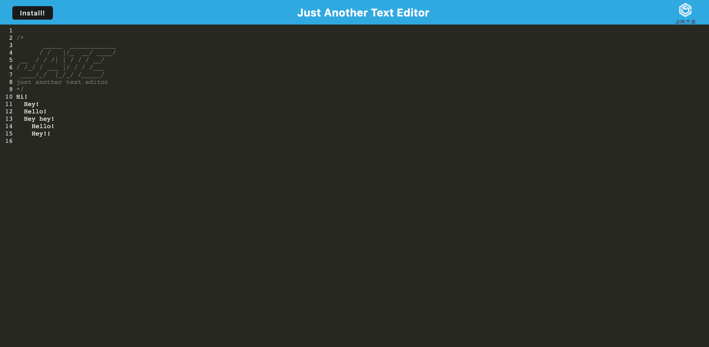

## Text Editor (PWA)

## Description

Introducing a modern text editor web app with an organized folder structure for smooth development. It effortlessly sets up backend and client serving using npm run start. Powered by Webpack, it optimizes JavaScript files for performance. Leveraging next-gen JavaScript, the app remains functional and error-free. IndexedDB ensures automatic content saving, and Workbox provides a smooth experience by pre-caching assets.

## Table of Contents

- [Description](#description)
- [Technology Used](#technology-used)
- [Deployment](#deployment)
- [License](#text-editor)
- [Contributing](#contributing)
- [Questions](#questions)

## Technology Used

- [JavaScript](https://developer.mozilla.org/en-US/docs/Web/JavaScript)
- [Node.js](https://nodejs.org/en)
- [Express.js](https://expressjs.com/)
- [npm](https://www.npmjs.com/)
- [Heroku](https://www.heroku.com/platform)

## Deployment

[Text Editor](https://github.com/elenagurchinskaia/text-editor-pwa)

## Contributing

N/A

## Questions

For any questions or inquires, feel free to reach out to me via GitHub:
[elenagurchinskaia](https://github.com/elenagurchinskaia) or Email: elenagurchinskaia@gmail.com.
